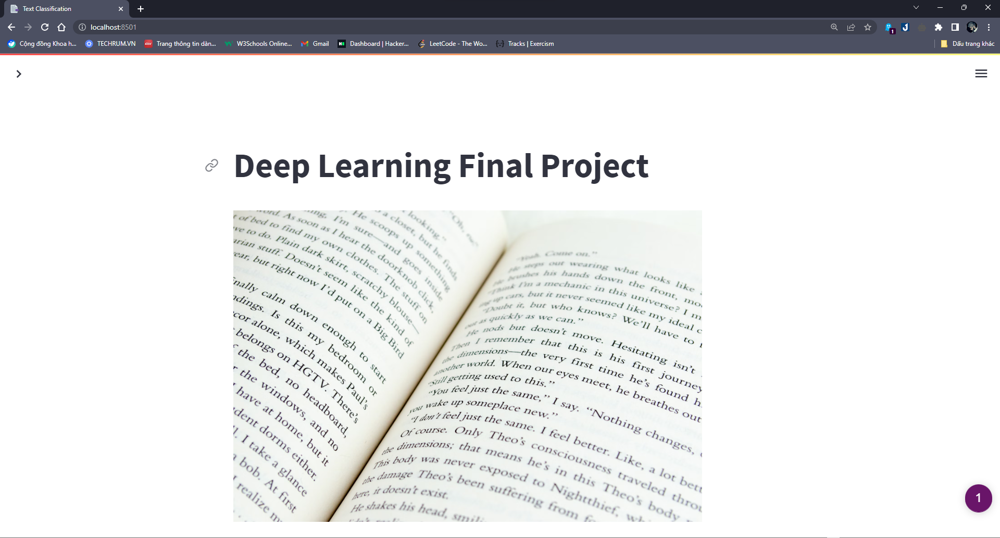

# Product category classification

This project is a project for final exam for Deep Learning course at National Economics University. 
Develop by [To Duc Anh](https://github.com/Hyprnx/). The project offers a solution for product category classification
problem. The dataset is crawled from [Shopee](https://shopee.vn/). 

This project features a deep learning model built with [PyTorch](https://pytorch.org/). The embedding data were 
calculated with [Vietnamese sBERT](https://huggingface.co/keepitreal/vietnamese-sbert).

The training process can be found in [notebook directory](/notebooks).

The project is now **LIVE** and accessible via [this link](https://hyprnx-text-classification-streamlit-app-7egu9j.streamlit.app/).

## About Dataset:
The dataset contains roughly 1,000,000 products with 4 different categories. The categories are:
- Electronics
- Cosmetics
- Fashion
- Mom & Baby

# About the model and steps:
Access the introduction page [here](https://hyprnx-text-classification-streamlit-app-7egu9j.streamlit.app/How_we_did_it)
to get information on how the model is built and how the steps are done.

## How to run the project on local machine:
This project was developed and deployed on a [Python 3.10](https://www.python.org/downloads/release/python-3109/) 
machine. To run the project on your local machine, you should have Python 3.10 installed. The project was developed with
the help of [Streamlit](https://streamlit.io/), a Python library for building web apps.

### Getting Started on your local machine:
1. Clone the project to your local machine:
```bash
git clone https://github.com/Hyprnx/Text-Classification
```
2. Setup and activate a virtual environment:
Setup:
```bash
python -m venv <envname>
```

Activate:
- On Mac:
  ```sh
  source <envname>/bin/activate
  ```
- On Windows:
  ```sh
  <envname>\Scripts\activate
  ```

3. Install requirements.txt
  ```sh
  pip install -r requirement.txt
  ```

4. Run the project:
  ```sh
    streamlit run streamlit_app.py
   ```

5. Open the link provided by Streamlit in your browser.

This link should be run on port 8501 (eg: http://localhost:8501). If you want to change the port, you can do so by
referencing the streamlit documentaion [here](https://docs.streamlit.io/library/advanced-features/configuration).

The project should look like this:


6. Enjoy the project!

## Others
The project also included a model (and also the ONNX version of the model) that can be used for inference. 
It located here: [model](resource/).

## Experimental:
### ONNX and GPU acceleration:
The inference time could be accelerated with the help of ONNX Runtime. In the provided model, the embedding time is 
pretty slow due to the fact that the embedding module is purely taken from transformer without any optimization. 
The reason is that, firstly, the sentence embedding that we use have some problem with the vocab size, hence the ONNX 
conversion cannot be completed. We probably can retrain the model with a smaller vocab size to make it work later on.
Secondly, the embedding process run entirely on CPU, which might not be so efficient for parallel computing. Provide a
GPU will definitely speed up the process. The embedding process with ~1M sentences takes around 10 minutes to complete 
on a nVidia P100 GPU, kindly provided by Google on Kaggle.

### DataFrame Library:
The project currently use [Pandas](https://pandas.pydata.org/) and it multi-threading variance 
[Modin](https://modin.readthedocs.io/en/latest/) to speed up data processing. But, these libraries are, still, not the 
fastest available. We could try to use [Polars](https://pola-rs.github.io/polars-book/user-guide/index.html) - a DataFrame
manipulation framework written in Rust. Which provide a blazing fast data processing speed. Equipped with blazing-ly 
fast and memory-efficient property of [Rust](https://www.rust-lang.org/). But, due to it lack of features since its
still in early development, we cannot use it for this project. But, we could try to use it in the future.
### Deployment:
We use the free tier of Streamlit cloud, which limited to 1GB of resources. This limitation is the reason you don't see
phoBERT classifier on the web app. The model is too big to be deployed on Streamlit cloud.

We can possibly rent a cloud base service from AWS, GCP or Azure to deploy the model. But you know, we are students, 
there are no financial benefit from doing that for demonstration purposes.


